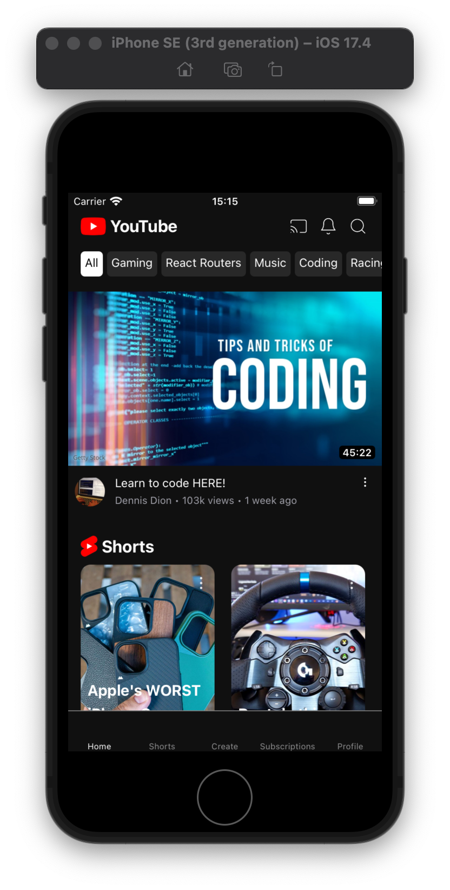
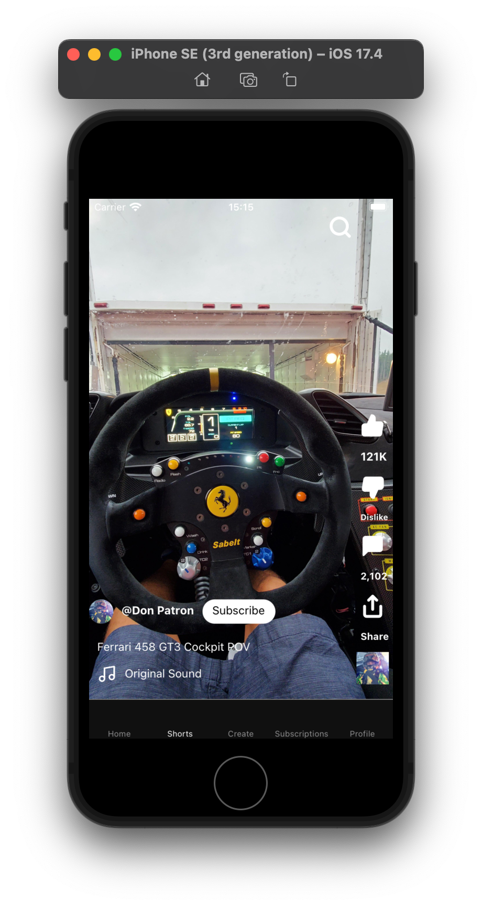
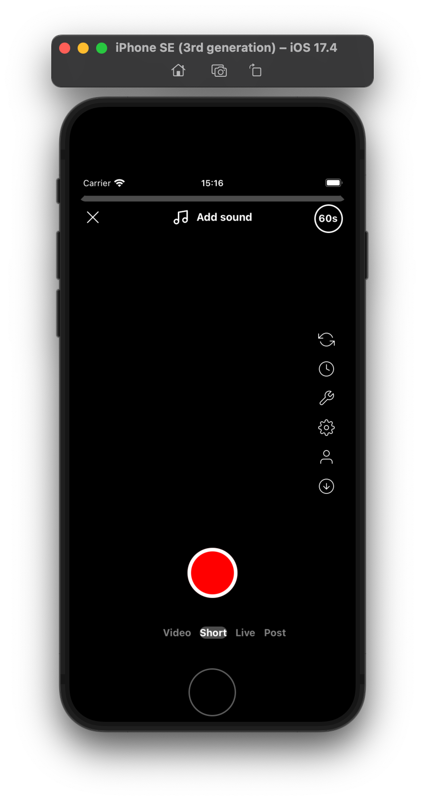

# myYouTubeClone

React Native app that emulates the current UI of the YouTube app. Download the latest version of YouTube (June 2024) and compare against my app here!

## Screenshots

Home:

Shorts:

Create:

